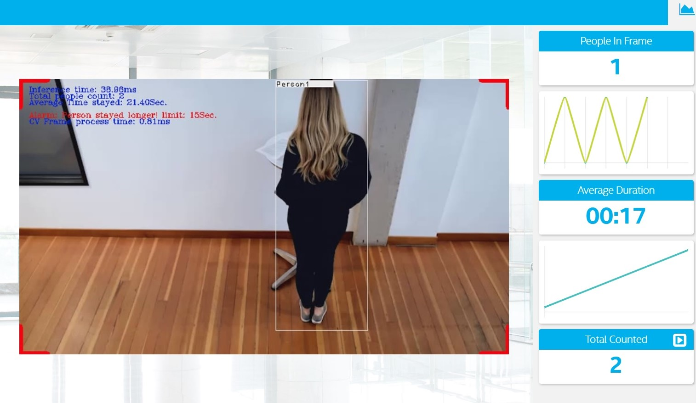
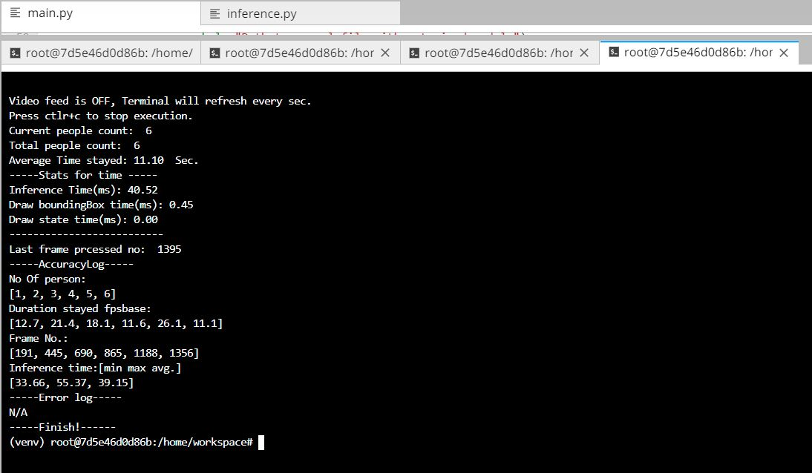
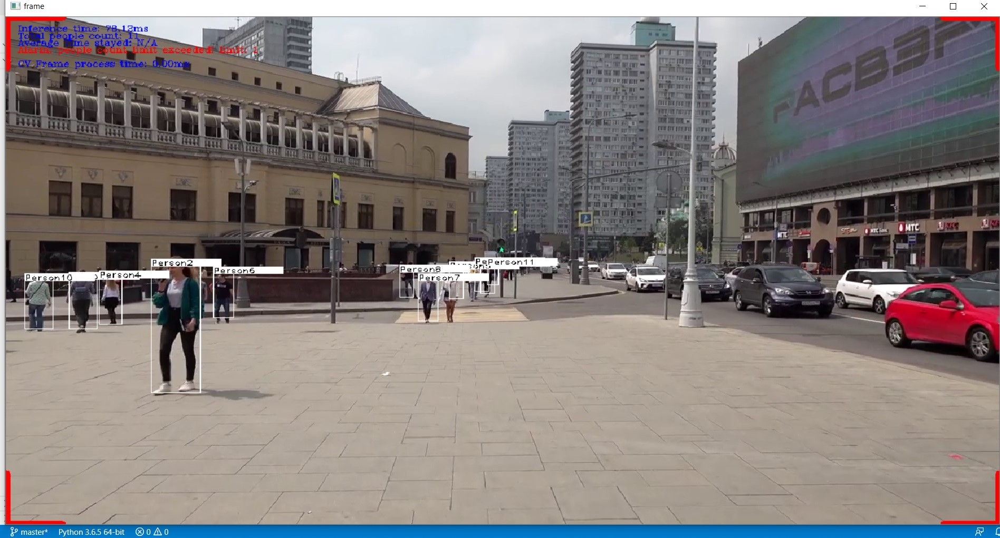

# Deploy a People Counter App at the Edge

| Details            |              |
|-----------------------|---------------|
| Programming Language: |  Python 3.5 or 3.6 |

**Features:**
- Count person on video.
- Calculates duration stayed, one person at a time.
- Run online app or with local setup.
- Input supported: Single image, Local video, webcam.
- Live Feed On/Off.
- Confugurable delay to currect counting in case of frequenct fluctuation in detection per frame.
- Selectable bounding box color.
- Selectable Alarm of more people appear on video. 
- Selectable Alarm if person stayed longer than set time.
- Write output video to local storage.
- log info in txt file in case of web app.
- Selectable confidence threshold.
- Live stats of inference time, Image processing time.
- Final report of overall stats in terminal at the end of video.

**Limitation**
- Can not count duration of multiple people in same frame
- Live feed On/Off in reatime is not possible due to ffmpeg arguments.

For more detail , use -h argument:

```
usage: main_win_local.py [-h] -m MODEL -i INPUT -fps FPS [-l CPU_EXTENSION]
                         [-d DEVICE] [-pt PROB_THRESHOLD] [-c BOX_COLOR]
                         [-ap ALARM_PEOPLE] [-ad ALARM_DURATION]
                         [-tv TOGGLE_VIDEO] [-ci CAM_ID] [-db DELAY_BAND]
                         [-wv WRITE_VIDEO]

optional arguments:
  -h, --help            show this help message and exit
  -m MODEL, --model MODEL
                        Path to an xml file with a trained model.
  -i INPUT, --input INPUT
                        Path to image, video file or for webcam just type CAM
  -fps FPS, --fps FPS   FPS of Video or webcam, required to get perfect
                        duration calculations.
  -l CPU_EXTENSION, --cpu_extension CPU_EXTENSION
                        MKLDNN (CPU)-targeted custom layers.Absolute path to a
                        shared library with thekernels impl.
  -d DEVICE, --device DEVICE
                        Specify the target device to infer on: CPU, GPU, FPGA
                        or MYRIAD is acceptable. Sample will look for a
                        suitable plugin for device specified (CPU by default)
  -pt PROB_THRESHOLD, --prob_threshold PROB_THRESHOLD
                        Probability threshold for detections filtering(0.5 by
                        default)
  -c BOX_COLOR, --box_color BOX_COLOR
                        Color of bounding box[RED,GREEN,BLUE,WHITE,RED](WHITE
                        by default)
  -ap ALARM_PEOPLE, --alarm_people ALARM_PEOPLE
                        Alarm when certain no people detected exceed the
                        limit(1 by default)
  -ad ALARM_DURATION, --alarm_duration ALARM_DURATION
                        Alarm when time of person stayed exceed the
                        limit(15sec. by default)
  -tv TOGGLE_VIDEO, --toggle_video TOGGLE_VIDEO
                        Toggle Video feed on or off [ON or OFF](on by default)
  -ci CAM_ID, --cam_id CAM_ID
                        input web Camera id(0 by default)
  -db DELAY_BAND, --delay_band DELAY_BAND
                        input delay band (Millis) to fix counting in case of
                        video fluctuation or frame loss(1000 millis by
                        default)
  -wv WRITE_VIDEO, --write_video WRITE_VIDEO
                        write video to local file Y or N [Y or N](on by
                        default)
```

**Demo video:**

- Web-application:[Youtube Link](https://youtu.be/JMvboBCW1ZU)
- Local system: [Youtube Link](https://www.youtube.com/watch?v=Wd6FCHBtWRY&feature=youtu.be)

**With live feed**



**Without live feed**



**Multi People count**



## What it Does

The people counter application will demonstrate how to create a smart video IoT solution using Intel® hardware and software tools. The app will detect people in a designated area, providing the number of people in the frame, average duration of people in frame, and total count.

## How it Works

The counter will use the Inference Engine included in the Intel® Distribution of OpenVINO™ Toolkit. The model used should be able to identify people in a video frame. The app should count the number of people in the current frame, the duration that a person is in the frame (time elapsed between entering and exiting a frame) and the total count of people. It then sends the data to a local web server using the Paho MQTT Python package.

You will choose a model to use and convert it with the Model Optimizer.


## Requirements

### Hardware

* 6th to 10th generation Intel® Core™ processor with Iris® Pro graphics or Intel® HD Graphics.
* OR use of Intel® Neural Compute Stick 2 (NCS2)
* OR Udacity classroom workspace for the related course

### Software

*   Intel® Distribution of OpenVINO™ toolkit 2019 R3 release
*   Node v6.17.1
*   Npm v3.10.10
*   CMake
*   MQTT Mosca server
  
        
## Setup

### Install Intel® Distribution of OpenVINO™ toolkit

Utilize the classroom workspace, or refer to the relevant instructions for your operating system for this step.

- [Linux/Ubuntu](./linux-setup.md)
- [Mac](./mac-setup.md)
- [Windows](./windows-setup.md)

### Install Nodejs and its dependencies

Utilize the classroom workspace, or refer to the relevant instructions for your operating system for this step.

- [Linux/Ubuntu](./linux-setup.md)
- [Mac](./mac-setup.md)
- [Windows](./windows-setup.md)

## Running code for webapp[Linux only]:

There are two files for linux to run:
1. main.py 
2. main_lin_local.py

For online app use **main.py**. Note: Online app will log all the messages to log.txt file in working directory.

### Configure dependency:

### Install npm

There are three components that need to be running in separate terminals for this application to work:

-   MQTT Mosca server 
-   Node.js* Web server
-   FFmpeg server
     
From the main directory:

* For MQTT/Mosca server:
   ```
   cd webservice/server
   npm install
   ```

* For Web server:
  ```
  cd ../ui
  npm install
  ```
  **Note:** If any configuration errors occur in mosca server or Web server while using **npm install**, use the below commands:
   ```
   sudo npm install npm -g 
   rm -rf node_modules
   npm cache clean
   npm config set registry "http://registry.npmjs.org"
   npm install
   ```

## What model to use

It is up to you to decide on what model to use for the application. You need to find a model not already converted to Intermediate Representation format (i.e. not one of the Intel® Pre-Trained Models), convert it, and utilize the converted model in your application.

For test purpose you can run intel preconverted model person-detection-retail-0013.

Step to download [Ucacity workspace]:
- source env:source /opt/intel/openvino/bin/setupvars.sh -pyver 3.5
- This will download all precision models to workspace folder.
- Step1: cd /opt/intel/openvino/deployment_tools/tools/model_downloader
- step2: sudo ./downloader.py -h
- step3: sudo ./downloader.py --name person-detection-retail-0013 -o /home/workspace/resources/

Note: After sucessfull download, move all the .xml and .bin filea to model folder for commandline arguments.

Or download all the converted models: [Click to Download Size:1.04GB](https://drive.google.com/open?id=1ItJQcAiqOskZVGS9ar7EuieClei7WO1P)


**If you are otherwise unable to find a suitable model after attempting and successfully converting at least three other models**, you can document in your write-up what the models were, how you converted them, and why they failed, and then utilize any of the Intel® Pre-Trained Models that may perform better.

## Run the application

From the main directory: All the four steps should done in seperate terminal.

### Step 1 - Start the Mosca server

```
cd webservice/server/node-server
node ./server.js
```

You should see the following message, if successful:
```
Mosca server started.
```

### Step 2 - Start the GUI

Open new terminal and run below commands.
```
cd webservice/ui
npm run dev
```

You should see the following message in the terminal.
```
webpack: Compiled successfully
```

### Step 3 - FFmpeg Server

Open new terminal and run the below commands.
```
sudo ffserver -f ./ffmpeg/server.conf
```

### Step 4 - Run the code

Open a new terminal to run the code. 

#### Setup the environment

You must configure the environment to use the Intel® Distribution of OpenVINO™ toolkit one time per session by running the following command:
```
source /opt/intel/openvino/bin/setupvars.sh -pyver 3.5
```

You should also be able to run the application with Python 3.6, although newer versions of Python will not work with the app.

#### Running on the CPU

When running Intel® Distribution of OpenVINO™ toolkit Python applications on the CPU, the CPU extension library is required. This can be found at: 

```
/opt/intel/openvino/deployment_tools/inference_engine/lib/intel64/
```

*Depending on whether you are using Linux or Mac, the filename will be either `libcpu_extension_sse4.so` or `libcpu_extension.dylib`, respectively.* (The Linux filename may be different if you are using a AVX architecture)

Though by default application runs on CPU, this can also be explicitly specified by ```-d CPU``` command-line argument:

```
python main.py -i resources/io/pca10.mp4 -m your-model.xml -l /opt/intel/openvino/deployment_tools/inference_engine/lib/intel64/libcpu_extension_sse4.so -d CPU -pt 0.5 -FPS 10 | ffmpeg -v warning -f rawvideo -pixel_format bgr24 -video_size 768x432 -framerate 24 -i - http://0.0.0.0:3004/fac.ffm
```
If you are in the classroom workspace, use the “Open App” button to view the output. If working locally, to see the output on a web based interface, open the link [http://0.0.0.0:3004](http://0.0.0.0:3004/) in a browser.

#### Running on the Intel® Neural Compute Stick

To run on the Intel® Neural Compute Stick, use the ```-d MYRIAD``` command-line argument:

```
python3.5 main.py -d MYRIAD -i resources/io/pca10.mp4 -m your-model.xml -pt 0.5 -FPS 10 | ffmpeg -v warning -f rawvideo -pixel_format bgr24 -video_size 768x432 -framerate 24 -i - http://0.0.0.0:3004/fac.ffm
```

To see the output on a web based interface, open the link [http://0.0.0.0:3004](http://0.0.0.0:3004/) in a browser.

**Note:** The Intel® Neural Compute Stick can only run FP16 models at this time. The model that is passed to the application, through the `-m <path_to_model>` command-line argument, must be of data type FP16.

#### Using a camera stream instead of a video file

To get the input video from the camera, use the `-i CAM` command-line argument. Specify the resolution of the camera using the `-video_size` command line argument. Specify webcame FPS by -FPS 

For example:
```
python main.py -i CAM -m your-model.xml -l /opt/intel/openvino/deployment_tools/inference_engine/lib/intel64/libcpu_extension_sse4.so -d CPU -pt 0.5 -FPS 25 | ffmpeg -v warning -f rawvideo -pixel_format bgr24 -video_size 768x432 -framerate 24 -i - http://0.0.0.0:3004/fac.ffm
```

To see the output on a web based interface, open the link [http://0.0.0.0:3004](http://0.0.0.0:3004/) in a browser.

**Note:**
User has to give `-video_size` command line argument according to the input as it is used to specify the resolution of the video or image file.

## A Note on Running Locally

The servers herein are configured to utilize the Udacity classroom workspace. As such,
to run on your local machine, you will need to change the below file:

```
webservice/ui/src/constants/constants.js
```

The `CAMERA_FEED_SERVER` and `MQTT_SERVER` both use the workspace configuration. 
You can change each of these as follows:

```
CAMERA_FEED_SERVER: "http://localhost:3004"
...
MQTT_SERVER: "ws://localhost:3002"
```

## Running Local setup without web app [Linux]:

There is no special dependecy for local setup:
- Run main_lin_local.py

```
python main.py -i resources/io/pca10.mp4 -m resources/intel/person-detection-retail-0013/FP32/person-detection-retail-0013.xml -pt 0.5 -fps 10 
```

For remote linux machine or udacity worspace use -tv OFF argument to disable output on display.

```
python main.py -i resources/io/pca10.mp4 -m resources/intel/person-detection-retail-0013/FP32/person-detection-retail-0013.xml -pt 0.5 -fps 10 
```

## Running Local setup without web app [Windows10]:

There is no special dependecy for local setup:
- Run main_win_local.py

```
python main_win_local.py -i resources/io/pca10.mp4 -m resources/intel/person-detection-retail-0013/FP32/person-detection-retail-0013.xml -pt 0.5 -fps 10 
```
